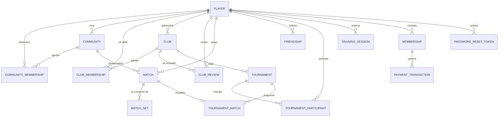

# PongRank — Plataforma Social y Competitiva para Tenis de Mesa

**Curso:** CS 2031 — Desarrollo Basado en Plataformas
**Entrega:** Semana 7 — Backend completo
**Repositorio:** https://github.com/celestesevillano/PongRank-Backend
**Despliegue:** _[PEGAR URL DEL DEPLOYMENT]_

### Integrantes

- Emiliano Chambi
- Celeste Sevillano
- Adriana Alvarado
- Treicy Calsina
- Andrea Vidal

---

## Índice

1. [Introducción](#1-introducción)
2. [Identificación del Problema o Necesidad](#2-identificación-del-problema-o-necesidad)
3. [Descripción de la Solución](#3-descripción-de-la-solución)
4. [Modelo de Entidades](#4-modelo-de-entidades)
5. [Manejo de Errores](#5-manejo-de-errores)
6. [Medidas de Seguridad Implementadas](#6-medidas-de-seguridad-implementadas)
7. [Eventos y Asincronía](#7-eventos-y-asincronía)
8. [GitHub & Management](#8-github--management)
9. [Instalación y Ejecución Local](#9-instalación-y-ejecución-local)
10. [Conclusión](#10-conclusión)
11. [Apéndices](#11-apéndices)

---

## 1. Introducción

### Contexto

El tenis de mesa amateur carece casi por completo de infraestructura digital. Un jugador federado tiene ranking, calendario y contrincantes asignados; quien entrena en la universidad o en un club de barrio no sabe cuál es su nivel real ni con quién puede jugar un partido equilibrado. En Lima la actividad se organiza por WhatsApp y acuerdos informales: los resultados se pierden y no hay forma de comparar el nivel entre grupos distintos. Identificamos un caso concreto en la propia universidad —cerca de 58 estudiantes que coordinan partidos sin ranking ni historial— que sirvió como comunidad de referencia.

El problema de fondo no es la ausencia de un rating, sino de descubrimiento y emparejamiento en un mercado con información asimétrica: oferta y demanda coexisten en el mismo espacio físico sin ningún mecanismo que las conecte. El rating es la infraestructura de confianza que habilita ese encuentro.

### Objetivos del Proyecto

- Construir un ranking objetivo basado en **Glicko-2**, que mide tanto la habilidad estimada como la confianza estadística en esa medición.
- Permitir el registro verificable de partidos mediante **doble confirmación**, evitando resultados falsos.
- Habilitar la organización social en **comunidades** con rankings internos propios.
- Ofrecer a los **clubes** un modelo B2B para gestionar afiliaciones y organizar torneos con formatos reales.
- Incorporar análisis técnico de la ejecución deportiva a partir de métricas de visión computacional capturadas en el dispositivo.

---

## 2. Identificación del Problema o Necesidad

### Descripción del Problema

El jugador amateur enfrenta tres carencias simultáneas: **no sabe cuál es su nivel**, porque la única referencia es la percepción subjetiva de su círculo cercano; **no encuentra rivales adecuados**, ya que sin información de nivel un partido equilibrado depende del azar; y **no tiene historial**, porque los resultados viven en la memoria de los participantes y no hay evidencia de rendimiento que mostrar al postular a un club.

Del lado de los clubes el problema es de gestión: no cuentan con herramientas accesibles para administrar socios, validar afiliaciones ni organizar torneos, y terminan usando hojas de cálculo desconectadas.

### Justificación

Un sistema de ranking convierte partidos sueltos en una progresión medible, y esa progresión es el principal motor de permanencia en deportes individuales. Dar a los clubes una herramienta de gestión construye además un puente entre el circuito amateur y el federado, hoy desconectados.

Técnicamente, el problema exige justamente lo que el curso evalúa: un modelo relacional no trivial, reglas de negocio con estados y transiciones, seguridad por roles, procesamiento asíncrono y comunicación en tiempo real.

---

## 3. Descripción de la Solución

### Funcionalidades Implementadas

| Funcionalidad | Descripción |
| :--- | :--- |
| **Autenticación y jugadores** | Registro con email único y contraseña BCrypt, login con JWT, refresh tokens, y perfil con datos deportivos (categoría FDPTM, federado, contacto opcional). |
| **Ranking Glicko-2** | Cada jugador mantiene rating (1500), desviación RD (350) y volatilidad (0.06). A diferencia de Elo, Glicko-2 modela la incertidumbre: un jugador nuevo tiene RD alta y su posición pesa menos que la de alguien con historial extenso. |
| **Partidos con doble confirmación** | Un jugador reporta el marcador set por set y el rival debe confirmarlo antes de que afecte al ranking; si hay desacuerdo, el partido pasa a disputa. Es el mecanismo anti-fraude del sistema. |
| **Comunidades** | Grupos por institución o lugar de juego con ranking interno, administración delegable, control de membresías y límites según el plan contratado. |
| **Clubes (B2B)** | Registro con documento de afiliación, flujo de revisión por un administrador (aprobación, rechazo con motivo, reenvío), gestión de socios y transferencia de administración. |
| **Torneos** | Round-robin, eliminación directa y fase de grupos con clasificación a llaves, con distribución de grupos, calendario, brackets, walkovers y tablas con criterios de desempate. |
| **Amistades** | Relación reflexiva entre jugadores con estados pendiente, aceptada y rechazada, que habilita los retos directos. |
| **Entrenamiento** | Ingesta de métricas biomecánicas capturadas en el dispositivo del usuario mediante visión computacional. |
| **Membresías y pagos** | Planes integrados con MercadoPago (Checkout Pro), webhook de confirmación y job programado que vence las membresías expiradas. |
| **Tiempo real** | WebSockets con STOMP para retos y actualizaciones de marcador. |
| **Correo transaccional** | Correos HTML de bienvenida, recuperación de contraseña y confirmación de pago, enviados de forma asíncrona con plantillas Thymeleaf. |
| **Recuperación de contraseña** | Flujo de token de un solo uso con expiración: `/forgot-password` emite el enlace por correo y `/reset-password` lo canjea. |

### Tecnologías Utilizadas

| Categoría | Tecnología |
| :--- | :--- |
| Lenguaje | Java 21 |
| Framework | Spring Boot 4.1 (Web MVC, Data JPA, Security, Validation, WebSocket) |
| Persistencia | PostgreSQL + Hibernate ORM |
| Seguridad | Spring Security, JJWT, BCrypt |
| Mapeo | ModelMapper |
| Utilidades | Lombok |
| Correo | Spring Boot Mail (JavaMailSender) + plantillas Thymeleaf |
| API externa | MercadoPago SDK (Checkout Pro) |
| Testing | JUnit 5, Mockito, AssertJ, Spring Security Test |
| Documentación | Colección Postman |
| Build | Maven |
| Entorno local | Docker Compose |

---

## 4. Modelo de Entidades

El dominio se compone de **16 entidades JPA**. Todas las colecciones usan `FetchType.LAZY` para evitar el problema de N+1 queries, y las relaciones muchos-a-muchos se modelan como entidades explícitas porque llevan atributos propios (rol, estado, fechas).



### Descripción de Entidades Principales

**Player** — Entidad central. Credenciales (email único, password BCrypt), rol global (`ROLE_USER`, `ROLE_CLUB_ADMIN`, `ROLE_SYSTEM_ADMIN`), datos deportivos y los tres valores de Glicko-2.

**Community / CommunityMembership** — Muchos-a-muchos explícito. La membresía guarda rol (`MEMBER` o `COMMUNITY_ADMIN`), estado y fechas. La restricción única `uk_player_community` impide duplicados, lo que obliga a que salir y reingresar sean cambios de estado sobre la misma fila. Lleva índices compuestos sobre `(community_id, status)` y `(player_id, status)`, los filtros más frecuentes.

**Match / MatchSet** — Referencia a dos jugadores y opcionalmente a una comunidad, con 2 a 7 sets en cascada con `orphanRemoval`. Registra el delta de rating, las coordenadas del lugar y el motivo de disputa. Su campo `status` implementa la máquina de estados de doble confirmación.

**Club / ClubMembership / ClubReview** — Modelo B2B. `ClubReview` mantiene el historial de revisiones, de modo que un rechazo y su reenvío quedan auditados.

**Tournament / TournamentParticipant / TournamentMatch** — El participante guarda seed, grupo y orden de desempate. `TournamentMatch` mantiene una relación uno-a-uno opcional con `Match`, lo que permite que un partido de torneo se juegue y puntúe con el mismo flujo que uno casual.

**Friendship** — Relación reflexiva sobre `Player` con estados `PENDING`, `ACCEPTED` y `REJECTED`, y restricción única sobre el par.

**Membership / PaymentTransaction** — Vinculan al jugador con su plan vigente y el historial de pagos.

**PasswordResetToken** — Token de un solo uso con fecha de expiración y marca de consumido, que respalda el flujo de recuperación de contraseña sin exponer credenciales por correo.

### Decisiones de Diseño Destacadas

**Borrado lógico en lugar de físico.** Las comunidades pasan a estado `ARCHIVED` en vez de eliminarse: `Match` guarda `community_id`, y un borrado real dejaría huérfano el historial que alimenta el cálculo de ratings.

**Autorización por membresía, no por creador.** Los permisos se verifican contra una membresía activa con rol `COMMUNITY_ADMIN`, nunca contra el campo `creator`, que es un dato histórico: quien transfiere la administración debe perder privilegios en ese momento.

**Bloqueo pesimista en membresías.** La regla "una comunidad nunca puede quedarse sin administradores" no se puede expresar como constraint: dos administradores que salieran a la vez leerían el mismo conteo y ambos pasarían la validación. Por eso ingreso, cambio de rol y salida cargan la comunidad con `PESSIMISTIC_WRITE`.

**404 en lugar de 403 para recursos ajenos.** Un 403 confirmaría que el recurso existe, filtrando información.

---

## 5. Manejo de Errores

El sistema implementa una jerarquía de excepciones de negocio encabezada por la clase abstracta `ApiException`, que asocia cada excepción con su código HTTP. Todas heredan de `RuntimeException`, lo que garantiza el rollback automático de las transacciones `@Transactional` — una excepción verificada haría commit y dejaría datos inconsistentes.

| Excepción | HTTP | Se lanza cuando |
| :--- | :---: | :--- |
| `ResourceNotFoundException` | 404 | El recurso solicitado no existe |
| `ConflictException` | 409 | Conflicto de estado: nombre duplicado, comunidad archivada, solicitud ya procesada |
| `UnauthorizedActionException` | 403 | El usuario está autenticado pero carece de permisos |
| `InvalidCredentialsException` | 401 | Credenciales incorrectas en el login |
| `EmailAlreadyExistsException` | 409 | El email ya está registrado |
| `InvalidMatchStateException` | 409 | Transición de estado inválida en un partido |
| `FriendshipRequestException` | 400 | Solicitud de amistad inválida |
| `CommunityMembershipException` | 400 | Operación inválida sobre una membresía |
| `RatingCalculationException` | 500 | Error en el cálculo de Glicko-2 |
| `PaymentProcessingException` | 500 | Fallo en la pasarela de pagos |

El `GlobalExceptionHandler`, anotado con `@RestControllerAdvice`, centraliza la traducción a respuestas HTTP. Captura `ApiException` de forma polimórfica, de modo que cualquier excepción nueva que herede de ella queda manejada automáticamente. Intercepta además `MethodArgumentNotValidException` —fallos de `@Valid`, devuelve 400 con el detalle campo por campo—, `HttpMessageNotReadableException` para JSON mal formado, y las excepciones de autenticación y autorización de Spring Security.

Todas las respuestas de error comparten el formato de `ErrorResponseDTO`:

```json
{
  "timestamp": "2026-09-25T18:30:00",
  "status": 409,
  "error": "Conflict",
  "message": "Community name already in use: UTEC",
  "path": "/api/v1/communities"
}
```

Centralizar el manejo evita que cada controlador repita bloques `try/catch` y garantiza que el cliente reciba siempre la misma estructura, lo que permite al frontend manejar errores de forma genérica.

---

## 6. Medidas de Seguridad Implementadas

### Seguridad de Datos

**Cifrado de contraseñas.** BCrypt, algoritmo adaptativo con salt automático. Nunca se guardan en texto plano y ningún DTO de respuesta expone el campo.

**Autenticación stateless con JWT.** El login emite un token firmado con HMAC-SHA256 que contiene identificador, email y roles. El `JwtAuthenticationFilter` intercepta cada request, valida firma y expiración, y publica la identidad en el `SecurityContextHolder`.

**Refresh tokens.** El access token dura 24 horas y el refresh 7 días: limita la ventana de exposición si un token se ve comprometido, sin obligar a reautenticarse continuamente.

**Secretos en variables de entorno.** `JWT_SECRET` se declara sin valor por defecto de forma deliberada: si falta, la aplicación falla al arrancar en lugar de operar con una clave conocida. El `.env` está excluido por `.gitignore`.

**Autorización en dos niveles.** Roles globales restringidos con `hasRole("SYSTEM_ADMIN")` y `@PreAuthorize` en controladores; la verificación fina sobre un recurso concreto ocurre en la capa de servicio contra los roles contextuales de cada comunidad o club.

**Privacidad del contacto.** El email y el WhatsApp solo se devuelven si el jugador activó compartir contacto, o si quien consulta es él mismo o un administrador.

### Prevención de Vulnerabilidades

**Inyección SQL.** Todas las consultas usan JPQL con parámetros nombrados o métodos derivados de Spring Data. No se concatena entrada del usuario en ninguna consulta.

**Validación de entrada.** Cada DTO de request declara restricciones de Bean Validation (`@NotBlank`, `@Size`, `@Email`, `@NotNull`) ejecutadas con `@Valid` antes de llegar a la lógica de negocio. Se duplican deliberadamente a nivel de entidad y de base de datos para que ninguna ruta de acceso pueda saltárselas.

**CORS restringido.** Los orígenes permitidos se configuran mediante `cors.allowed-origins` en lugar de aceptar cualquier origen.

**CSRF deshabilitado de forma justificada.** Al ser una API stateless que autentica por header y no por cookies de sesión, el vector de CSRF no aplica.

**Agotamiento de recursos.** Los listados de comunidades, partidos, torneos, clubes y entrenamientos están paginados con un tamaño máximo acotado, de modo que una petición no pueda solicitar un volumen arbitrario de registros.

**Fuga de información.** Ningún endpoint devuelve entidades JPA directamente: todas las respuestas pasan por DTOs que exponen únicamente los campos previstos.

---

## 7. Eventos y Asincronía

### Eventos Implementados

El sistema desacopla operaciones secundarias del flujo principal mediante `ApplicationEventPublisher` y `@EventListener`.

**`MatchConfirmedEvent`** se publica cuando ambos jugadores confirman el resultado de un partido, y tiene dos consumidores independientes:

- `MatchRatingEventListener` dispara el recálculo de Glicko-2 para los dos jugadores.
- `TournamentMatchEventListener` actualiza el cruce correspondiente del torneo, avanza el bracket y recalcula la tabla de posiciones cuando el partido pertenece a una competición.

El valor está en el desacoplamiento: el servicio de partidos no conoce al motor de rating ni al de torneos. Publica un hecho —"este partido quedó confirmado"— y cada módulo interesado reacciona por su cuenta, de modo que añadir un consumidor nuevo no exige modificar el código existente.

### Procesamiento Asíncrono

`AsyncConfig` habilita `@EnableAsync` y define un `ThreadPoolTaskExecutor` propio en lugar del executor por defecto, lo que permite controlar el tamaño del pool y la cola de tareas.

El cálculo de Glicko-2 se ejecuta con `@Async` por experiencia de usuario: el algoritmo involucra iteraciones numéricas para converger la volatilidad, y bloquear la respuesta HTTP haría que confirmar un partido tardara cientos de milisegundos. Al procesarlo en otro hilo, el jugador recibe la confirmación de inmediato y el ranking se actualiza en segundo plano.

`SchedulingConfig` y `MembershipExpirationScheduler` añaden un job diario que vence las membresías expiradas. Esa tarea debe ocurrir aunque nadie use el sistema, por lo que un scheduler —y no una petición— es el mecanismo adecuado.

### Servicio de Correo Electrónico

`EmailServiceImpl` envía correos HTML con `JavaMailSender` y plantillas Thymeleaf, en tres casos de uso: bienvenida al registrarse, enlace de recuperación de contraseña y confirmación de pago de membresía. Los tres métodos están anotados con `@Async("taskExecutor")` y comparten un método privado que construye el `MimeMessage` y captura los fallos de envío.

La asincronía es imprescindible aquí: un servidor SMTP lento o caído no debe impedir que un jugador se registre ni que un pago se acredite. Al desacoplar el envío, un fallo de correo queda registrado sin propagarse a la transacción de negocio.

---

## 8. GitHub & Management

### Gestión de Tareas

_[COMPLETAR: ¿se usó GitHub Projects o Issues? ¿Cómo se asignaron las tareas entre los cinco integrantes? ¿Milestones por sprint? ¿Labels por módulo?]_

El trabajo se organizó en tres sprints:

- **Sprint 1** (hasta el 14 de septiembre) — Entidades JPA, persistencia, seguridad JWT y DTOs.
- **Sprint 2** (15–21 de septiembre) — Matchmaking, motor Glicko-2, WebSockets y eventos.
- **Sprint 3** (22–25 de septiembre) — Testing, colección Postman, informe y despliegue.

La división por módulos fue: partidos y sets, jugadores y amistades, comunidades, clubes y torneos, y entrenamiento junto con el manejo global de excepciones.

### Flujo de Trabajo con Git

El equipo trabajó con una rama por funcionalidad siguiendo la convención `feature/*` para nuevos módulos y `fix/*` para correcciones, integrándolas a `main` mediante pull requests. Los mensajes de commit siguen la convención de Conventional Commits (`feat(match):`, `fix(friendship):`, `test(player):`), lo que permite leer el historial por módulo y tipo de cambio.

### GitHub Actions

_[COMPLETAR: describir el pipeline —qué lo dispara y qué pasos ejecuta—. Si no se implementó, indicarlo aquí y moverlo a Trabajo Futuro.]_

---

## 9. Instalación y Ejecución Local

### Requisitos

- Java 21 o superior
- Maven 3.9+
- PostgreSQL 14+ (o Docker Compose)

### Variables de Entorno Requeridas

Copiar `.env.example` a `.env` y completar los valores:

| Variable | Descripción | Obligatoria |
| :--- | :--- | :---: |
| `SPRING_DATASOURCE_URL` | URL JDBC de PostgreSQL | No |
| `SPRING_DATASOURCE_USERNAME` | Usuario de la base de datos | No |
| `SPRING_DATASOURCE_PASSWORD` | Contraseña de la base de datos | No |
| `JWT_SECRET` | Clave de firma en base64 (256 bits) | **Sí** |
| `JWT_EXPIRATION` | Vigencia del access token en ms | No (24 h) |
| `JWT_REFRESH_EXPIRATION` | Vigencia del refresh token en ms | No (7 días) |
| `CORS_ALLOWED_ORIGINS` | Orígenes permitidos, separados por coma | No |
| `MERCADOPAGO_ACCESS_TOKEN` | Token de MercadoPago | **Sí** |
| `MERCADOPAGO_PUBLIC_KEY` | Clave pública de MercadoPago | **Sí** |

### Pasos

```bash
# 1. Clonar el repositorio
git clone https://github.com/celestesevillano/PongRank-Backend.git
cd PongRank-Backend

# 2. Levantar la base de datos
docker compose up -d

# 3. Configurar las variables de entorno
cp .env.example .env

# 4. Ejecutar
./mvnw spring-boot:run
```

La aplicación queda disponible en `http://localhost:8080`.

### Documentación de la API

La colección **`postman_collection.json`** se encuentra en la raíz del repositorio, con todos los endpoints organizados por módulo, variables definidas y la autorización Bearer configurada a nivel de colección. Para probar endpoints protegidos, autenticarse primero en `POST /api/v1/auth/login`; el token queda guardado en la variable de colección y se envía automáticamente en las siguientes peticiones.

### Endpoints Principales

| Módulo | Endpoints |
| :--- | :--- |
| Autenticación | `POST /api/v1/auth/register`, `/login`, `/refresh`, `/forgot-password`, `/reset-password` · `GET /me` |
| Jugadores | `POST /api/v1/players/register` · `GET /{id}`, `/{id}/summary` · `PATCH /{id}` |
| Amistades | `POST /api/v1/friendships/requests` · `PATCH /{id}/accept`, `/{id}/reject` · `GET /players/{id}`, `/players/{id}/pending` |
| Comunidades | `POST/GET /api/v1/communities` · `GET /me`, `/{id}`, `/{id}/members`, `/{id}/ranking` · `PUT/DELETE /{id}` · `POST /{id}/members` · `PATCH /{id}/members/{playerId}/role` |
| Partidos | `POST/GET /api/v1/matches` · `GET /open?latitude=&longitude=`, `/{id}`, `/player/{playerId}` · `POST /{id}/join`, `/{id}/submit` · `PUT /{id}/confirm`, `/{id}/dispute`, `/{id}/cancel` |
| Sets | `GET /api/v1/matches/{matchId}/sets` · `GET /api/v1/match-sets/{setId}` |
| Clubes | `POST/GET /api/v1/clubs` · `GET/PATCH /{id}` · revisión en `/api/v1/admin/clubs` |
| Afiliaciones | `POST /api/v1/club-memberships` · `PATCH /{id}/approve`, `/reject`, `/cancel`, `/leave` |
| Torneos | `POST/GET /api/v1/tournaments` · participantes, seeding, `/start`, `/groups`, `/knockout`, `/sync-results` |
| Entrenamiento | `POST /api/v1/training-sessions` · `GET /players/{id}`, `/players/{id}/best` |
| Pagos | `POST /api/v1/payments/create-preference`, `/webhook` · `GET /status/{id}` |

---

## 10. Conclusión

### Logros del Proyecto

El backend implementa un dominio de **16 entidades** con relaciones no triviales: dos muchos-a-muchos con atributos propios, una reflexiva y una uno-a-uno opcional entre partidos casuales y de torneo. La arquitectura mantiene separación estricta en capas —controlador, servicio, repositorio— con inyección por constructor y sin lógica de negocio en los controladores. En seguridad se alcanzó autenticación stateless con JWT y refresh tokens, cifrado BCrypt, autorización en dos niveles y secretos exclusivamente por variables de entorno.

El sistema resuelve el problema identificado: un jugador puede registrarse, encontrar rivales de nivel similar, jugar partidos verificados por ambas partes, ver evolucionar su rating con una medida explícita de confianza estadística, y competir tanto en el ranking global como en el de su comunidad.

### Aprendizajes Clave

**Las reglas de negocio se rompen bajo concurrencia.** "Una comunidad nunca puede quedarse sin administradores" parecía resuelta con una validación simple, hasta que analizamos qué ocurre si dos administradores salen a la vez: ambos leen el mismo conteo y ambos pasan. Identificar esas condiciones de carrera y resolverlas con bloqueo pesimista fue el aprendizaje más valioso.

**El borrado físico rara vez es la respuesta.** Eliminar una comunidad habría roto la integridad referencial con los partidos jugados en ella y destruido el historial que alimenta los ratings.

**Los DTOs no son burocracia.** Exponer una entidad directamente habría filtrado el hash de las contraseñas al JSON de respuesta, además de provocar errores de carga perezosa.

**Desacoplar con eventos escala mejor que llamar servicios directamente.** El servicio de partidos no conoce al motor de rating ni al de torneos y, aun así, ambos reaccionan correctamente cuando un partido se confirma.

### Trabajo Futuro

- **Documentación OpenAPI/Swagger** generada automáticamente desde los controladores con springdoc.
- **Paginación en los listados restantes** de jugadores y amistades, homogeneizándolos con el resto de módulos.
- **Almacenamiento en S3** para documentos de afiliación y fotos de perfil.
- **Tests de integración** con TestContainers para validar consultas y constraints contra una base de datos real.
- **Aplicación móvil** que consuma esta API e integre la captura de métricas con MediaPipe en el dispositivo.

---

## 11. Apéndices

### Licencia

Este proyecto se distribuye bajo la **Licencia MIT**. El texto completo se encuentra en el archivo [`LICENSE`](LICENSE) en la raíz del repositorio.

### Referencias

- Glickman, M. E. (2012). *Example of the Glicko-2 system*. Boston University.
- Spring Boot Reference Documentation — https://docs.spring.io/spring-boot/docs/current/reference/html/
- Spring Security Reference — https://docs.spring.io/spring-security/reference/
- Jakarta Persistence (JPA) Specification — https://jakarta.ee/specifications/persistence/
- Fielding, R. T. (2000). *Architectural Styles and the Design of Network-based Software Architectures* (Cap. 5: REST).
- MercadoPago Developers — Checkout Pro — https://www.mercadopago.com.pe/developers
- Federación Deportiva Peruana de Tenis de Mesa (FDPTM) — categorías y reglamento de juego.
