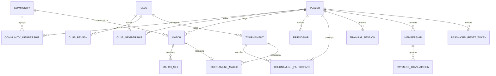
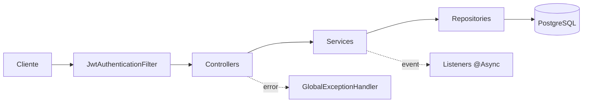

# PongRank — Plataforma Social y Competitiva para Tenis de Mesa

**Curso:** CS 2031 — Desarrollo Basado en Plataformas · **Entrega:** Semana 7
**Repositorio:** https://github.com/celestesevillano/PongRank-Backend
**Despliegue:** _[PEGAR URL DEL DEPLOYMENT]_

### Integrantes

| Nombre completo | Código |
| :--- | :--- |
| Andrea Alejandra Vidal Coello | 202410193 |
| Treicy Calsina Gutiérrez | 202520007 |
| Adriana Celeste Sevillano Común | 202310146 |
| Adriana Celeste Alvarado León | 202420154 |
| Emiliano Efraín Jesús Chambi Mamani | 202310178 |

### Índice

[Introducción](#1-introducción) · [Problema](#2-identificación-del-problema) · [Solución](#3-descripción-de-la-solución) · [Entidades](#4-modelo-de-entidades) · [Errores](#5-manejo-de-errores) · [Seguridad](#6-medidas-de-seguridad) · [Eventos](#7-eventos-y-asincronía) · [GitHub](#8-github--management) · [Instalación](#9-instalación-y-ejecución-local) · [Conclusión](#10-conclusión) · [Apéndices](#11-apéndices)

---

## 1. Introducción

### Contexto

El tenis de mesa amateur carece de infraestructura digital. Un jugador federado tiene ranking y contrincantes asignados; quien entrena en la universidad no sabe cuál es su nivel ni con quién jugar un partido parejo. Todo se organiza por WhatsApp: los resultados se pierden y no hay forma de comparar niveles entre grupos. Identificamos un caso concreto en UTEC: unos 58 estudiantes que coordinan partidos sin ranking ni historial.

El problema de fondo no es la ausencia de un rating, sino de descubrimiento y emparejamiento con información asimétrica: oferta y demanda coexisten en el mismo espacio físico sin mecanismo que las conecte. El rating es la infraestructura de confianza que habilita ese encuentro.

### Objetivos

Construir un ranking objetivo con **Glicko-2**, que mide habilidad y confianza estadística; registrar partidos de forma verificable mediante **doble confirmación**; organizar a los jugadores en **comunidades** con rankings internos; ofrecer a los **clubes** un modelo B2B con afiliaciones y torneos; e incorporar análisis del golpe por visión computacional.

## 2. Identificación del Problema

**Descripción.** El jugador amateur enfrenta tres carencias: **no sabe cuál es su nivel**, porque su única referencia es subjetiva; **no encuentra rivales adecuados**, ya que sin información de nivel un partido parejo depende del azar; y **no tiene historial**, porque los resultados viven en la memoria de los participantes. Del lado de los clubes el problema es de gestión: no tienen herramientas para administrar socios, validar afiliaciones ni organizar torneos.

**Justificación.** Un ranking convierte partidos sueltos en progresión medible, principal motor de permanencia en deportes individuales, y tiende un puente entre el circuito amateur y el federado. Técnicamente el problema exige lo que el curso evalúa: modelo relacional no trivial, reglas de negocio con estados, seguridad por roles, asincronía y tiempo real.

## 3. Descripción de la Solución

### Funcionalidades Implementadas

| Funcionalidad | Descripción |
| :--- | :--- |
| **Autenticación** | Email único, contraseña BCrypt, JWT con refresh tokens y recuperación por token de un solo uso. |
| **Ranking Glicko-2** | Rating (1500), desviación RD (350) y volatilidad (0.06). A diferencia de Elo modela la incertidumbre: un jugador nuevo tiene RD alta y su posición pesa menos. |
| **Partidos** | Marcador set por set que el rival confirma antes de afectar al ranking; si discrepa, pasa a disputa. Mecanismo anti-fraude. |
| **Buscador de rivales** | Partidas abiertas cercanas filtradas por nivel, con opción de unirse. |
| **Comunidades** | Grupos con ranking interno, administración delegable y límites según el plan. |
| **Clubes (B2B)** | Alta con documento de afiliación, revisión administrativa, gestión de socios y transferencia. |
| **Torneos** | Round-robin, eliminación directa y grupos, con calendario, brackets, walkovers y desempates. |
| **Amistades** | Relación reflexiva con estados pendiente, aceptada y rechazada. |
| **Entrenamiento** | Métricas biomecánicas on-device (requiere plan PRO o ENTERPRISE). |
| **Membresías** | Planes FREEMIUM, BASIC, PRO y ENTERPRISE vía MercadoPago, con webhook y vencimiento programado. |
| **Correo y tiempo real** | Correos HTML asíncronos y notificaciones WebSocket/STOMP. |

### Tecnologías Utilizadas

Java 21 · Spring Boot 4.1 (Web MVC, Data JPA, Security, Validation, WebSocket, Mail) · PostgreSQL con Hibernate · JJWT y BCrypt · ModelMapper · Thymeleaf · Lombok · MercadoPago SDK · JUnit 5, Mockito y AssertJ · Maven · Docker Compose · GitHub Actions.

## 4. Modelo de Entidades

El dominio tiene **16 entidades JPA**. Las colecciones usan `FetchType.LAZY` para evitar N+1 queries, y las relaciones muchos-a-muchos se modelan como entidades explícitas porque llevan atributos propios.



**Player** — Entidad central: credenciales, rol global (`ROLE_USER`, `ROLE_CLUB_ADMIN`, `ROLE_SYSTEM_ADMIN`) y los tres valores de Glicko-2.

**Community / CommunityMembership** — Muchos-a-muchos explícito con rol, estado y fechas. La restricción `uk_player_community` impide duplicados, de modo que salir y reingresar son cambios de estado sobre la misma fila. Lleva índices compuestos sobre `(community_id, status)` y `(player_id, status)`.

**Match / MatchSet** — Dos jugadores, comunidad opcional y de 2 a 7 sets con `orphanRemoval`. Guarda el delta de rating y el motivo de disputa; su `status` implementa la máquina de estados.

**TournamentMatch** — Mantiene un uno-a-uno opcional con `Match`, lo que permite puntuar un partido de torneo con el mismo flujo que uno casual.

**Club**, **Friendship**, **Membership** y **PasswordResetToken** completan el modelo.

### Decisiones de Diseño

**Borrado lógico.** Las comunidades pasan a `ARCHIVED`: `Match` guarda `community_id` y un borrado real dejaría huérfano el historial que alimenta los ratings.

**Autorización por membresía, no por creador.** Los permisos se verifican contra una membresía activa con rol `COMMUNITY_ADMIN`, nunca contra `creator`: quien transfiere la administración debe perder privilegios.

**Bloqueo pesimista.** "Una comunidad nunca puede quedarse sin administradores" no se expresa como constraint: dos que salgan a la vez leerían el mismo conteo y ambos pasarían. Por eso esas operaciones usan `PESSIMISTIC_WRITE`.

**404 en vez de 403 para recursos ajenos**, para no confirmar que existen.

## 5. Manejo de Errores

La jerarquía la encabeza la clase abstracta `ApiException`, que asocia cada excepción con su código HTTP. Todas heredan de `RuntimeException`, garantizando el rollback de `@Transactional`; una excepción verificada haría commit y dejaría datos inconsistentes.

| HTTP | Excepciones |
| :--- | :--- |
| 400 | `FriendshipRequestException`, `InvalidMatchStateException`, `PaymentProcessingException` |
| 401 | `InvalidCredentialsException` |
| 403 | `UnauthorizedActionException`, `PlanRestrictionException` |
| 404 | `ResourceNotFoundException` |
| 409 | `ConflictException`, `EmailAlreadyExistsException`, `CommunityMembershipException` |
| 500 | `RatingCalculationException`, `EmailDeliveryException` |

El `GlobalExceptionHandler` (`@RestControllerAdvice`) captura `ApiException` de forma polimórfica, así que toda excepción nueva que herede de ella queda manejada sola. Intercepta además `MethodArgumentNotValidException` (400 con detalle campo por campo), `HttpMessageNotReadableException` y las de Spring Security. Centralizarlo evita repetir `try/catch` y garantiza una estructura única, definida en `ErrorResponseDTO` con `timestamp`, `status`, `error`, `message` y `path`.

## 6. Medidas de Seguridad

**Seguridad de datos.** Contraseñas con **BCrypt**, adaptativo y con salt; ningún DTO expone el campo. **JWT stateless**: el login emite un token HMAC-SHA256 con identificador, email y roles, que el `JwtAuthenticationFilter` valida en cada request. **Refresh tokens** de 7 días frente a un access token de 24 horas, para acotar la exposición. **Secretos por entorno**: `JWT_SECRET` se declara sin valor por defecto a propósito, así la aplicación falla al arrancar antes que operar con una clave conocida. **Autorización en dos niveles**: roles globales con `hasRole` y `@PreAuthorize`, y verificación por recurso en la capa de servicio. El email y el WhatsApp solo se devuelven si el jugador activó compartirlos.

**Prevención de vulnerabilidades.** Contra **inyección SQL**, todas las consultas usan JPQL con parámetros nombrados o métodos derivados. Cada DTO declara **Bean Validation** con `@Valid`, duplicada en entidad y base de datos para que ninguna ruta la evite. **CORS** restringido por `cors.allowed-origins`. **CSRF** deshabilitado con justificación: al autenticar por header y no por cookies, el vector no aplica. Los listados principales van **paginados** con tamaño acotado, y ningún endpoint devuelve entidades JPA.

## 7. Eventos y Asincronía

**Eventos.** `MatchConfirmedEvent` se publica cuando ambos jugadores confirman un resultado, con dos consumidores independientes: `MatchRatingEventListener` recalcula Glicko-2 y `TournamentMatchEventListener` avanza el bracket y la tabla si el partido es de torneo. El valor está en el desacoplamiento: el servicio de partidos no conoce al motor de rating ni al de torneos, publica un hecho y cada módulo reacciona solo, así que añadir un consumidor no exige tocar el código existente.

**Asincronía.** `AsyncConfig` habilita `@EnableAsync` con un `ThreadPoolTaskExecutor` propio. El cálculo de Glicko-2 corre con `@Async` porque itera numéricamente hasta converger la volatilidad: bloquear la respuesta haría que confirmar un partido tardara cientos de milisegundos. `MembershipExpirationScheduler` añade un job diario que vence membresías, tarea que debe ocurrir aunque nadie use el sistema.

**Correo.** `EmailServiceImpl` envía correos HTML con `JavaMailSender` y plantillas Thymeleaf en tres casos —bienvenida, recuperación y confirmación de pago—, todos `@Async`: un SMTP lento no debe frenar un registro ni un pago.

## 8. GitHub & Management

**Gestión de tareas.** Usamos **GitHub Issues** con las etiquetas estándar (`bug`, `enhancement`, `documentation`) más otras propias —`email`, `config`, `deployment`, `high-priority`, `accessibility`— para filtrar por área y urgencia, asignando cada issue al responsable de su módulo. El flujo fue una rama por tarea (`feature/*`, `fix/*`, `docs/*`, `ci/*`) integrada a `main` mediante pull requests revisados por otro integrante; se fusionaron **más de 50**. Los mensajes siguen Conventional Commits.

**GitHub Actions.** El workflow `.github/workflows/ci.yml` se dispara en cada push a `main` y en cada pull request hacia `main`. Corre sobre `ubuntu-latest`, instala JDK 21 Temurin con caché de Maven y ejecuta `./mvnw -B verify`, que compila y corre los tests. Elegimos ese disparador porque el riesgo real con cinco personas en módulos vecinos es integrar una rama que rompe otra: exigir que el build pase antes de fusionar impide que llegue código roto a `main`.

## 9. Instalación y Ejecución Local



Requiere Java 21, Maven 3.9+ y PostgreSQL 14+ (o Docker Compose). Copiar `.env.example` a `.env`. **Obligatorias**: `JWT_SECRET` (base64 de 256 bits), `MERCADOPAGO_ACCESS_TOKEN` y `MERCADOPAGO_PUBLIC_KEY`. **Opcionales**: las tres `SPRING_DATASOURCE_*`, `JWT_EXPIRATION`, `JWT_REFRESH_EXPIRATION` y `CORS_ALLOWED_ORIGINS`.

```bash
git clone https://github.com/celestesevillano/PongRank-Backend.git
cd PongRank-Backend && docker compose up -d
cp .env.example .env && ./mvnw spring-boot:run
```

La API queda en `http://localhost:8080`. La colección **`postman_collection.json`** está en la raíz, con los **80 endpoints** documentados por módulo, variables definidas y autorización Bearer de colección: basta ejecutar *Login* y el token se guarda solo.

Rutas base bajo `/api/v1`: `auth` (6 operaciones), `players` (5), `friendships` (5), `communities` (11), `matches` y `match-sets` (13), `clubs`, `club-memberships` y `admin/clubs` (20), `tournaments` (14), `training-sessions` (3) y `payments` (3).

## 10. Conclusión

**Logros.** El backend implementa **16 entidades** con relaciones no triviales —dos muchos-a-muchos con atributos propios, una reflexiva y un uno-a-uno opcional entre partidos casuales y de torneo— sobre una arquitectura en capas con inyección por constructor, más autenticación stateless con JWT, autorización en dos niveles y secretos solo por entorno. Un jugador puede registrarse, hallar rivales de nivel similar, jugar partidos verificados por ambas partes y ver evolucionar su rating con una medida explícita de confianza.

**Aprendizajes.** *Las reglas de negocio se rompen bajo concurrencia*: "una comunidad nunca puede quedarse sin administradores" parecía resuelta con una validación simple, hasta analizar qué pasa si dos salen a la vez; detectar esas condiciones de carrera y resolverlas con bloqueo pesimista fue lo más valioso. *El borrado físico rara vez es la respuesta*, porque habría roto la integridad referencial con los partidos jugados. *Los DTOs no son burocracia*: exponer la entidad habría filtrado el hash de las contraseñas. *Desacoplar con eventos escala mejor* que encadenar llamadas entre servicios.

**Trabajo futuro.** Documentación OpenAPI/Swagger con springdoc; paginación en jugadores y amistades; almacenamiento en S3; tests de integración con TestContainers; y una app móvil que consuma esta API con captura de métricas vía MediaPipe.

## 11. Apéndices

**Licencia.** **MIT**; texto completo en [`LICENSE`](LICENSE).

**Referencias.** Glickman, M. E. (2012). *Example of the Glicko-2 system*, Boston University · Fielding, R. T. (2000). *Architectural Styles and the Design of Network-based Software Architectures*, cap. 5 · [Spring Boot](https://docs.spring.io/spring-boot/docs/current/reference/html/) · [Spring Security](https://docs.spring.io/spring-security/reference/) · [Jakarta Persistence](https://jakarta.ee/specifications/persistence/) · [MercadoPago](https://www.mercadopago.com.pe/developers) · FDPTM.
